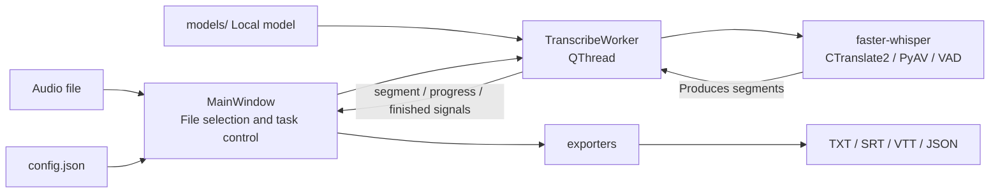
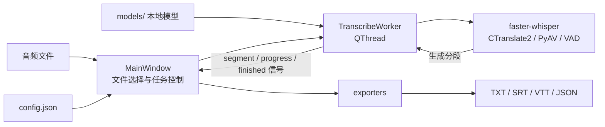

# WhisperDesk

[English](#english) · [简体中文](#chinese)

<a id="english"></a>

WhisperDesk is a local desktop speech-to-text application powered by [faster-whisper](https://github.com/SYSTRAN/faster-whisper), CTranslate2, and PySide6.

Your audio and transcripts stay on your computer. An internet connection is only required to install dependencies and download the model.

## Features

- Select or drag and drop `mp3`, `wav`, `m4a`, `mp4`, `flac`, `ogg`, `aac`, `webm`, and `opus` files
- Detect the spoken language automatically or choose from several common languages
- Select NVIDIA CUDA or CPU automatically, with manual device and compute-type controls
- Run transcription in a background thread while displaying segments, timestamps, and progress live
- Configure VAD, `beam_size`, and an initial prompt
- Export `txt`, `srt`, `vtt`, and `json` without overwriting existing files
- Choose a dark, light, or system theme
- Run entirely with a local model; Whisper large-v3 is the default

## Quick start

The release workflow uses Python 3.11, so the same version is recommended for local development.

```bash
git clone git@github.com:Dilyar93/WhisperDesk.git
cd WhisperDesk
python -m venv .venv
```

Activate the virtual environment:

```powershell
# Windows PowerShell
.venv\Scripts\Activate.ps1
```

```bash
# Linux / macOS
source .venv/bin/activate
```

Install the dependencies and download the default model:

```bash
python -m pip install -r requirements.txt
python scripts/download_model.py
```

The model is approximately 3 GB. If Hugging Face is difficult to reach from your location, you can use a mirror:

```bash
python scripts/download_model.py --hf-mirror https://hf-mirror.com
```

Start the application:

```bash
python -m app.main
```

## Usage

1. Click the drop area to choose an audio file, or drag a file into the window.
2. Select the language, model, and processing device.
3. Click **Start transcription** (`开始转写`).
4. When transcription finishes, files are written to `output/` under the application root by default. During development this is the project root; in a packaged build it is the folder containing the EXE. You can change the directory and formats in Settings.

The default model location is:

```text
models/
└── faster-whisper-large-v3/
    ├── model.bin
    ├── tokenizer.json
    └── config.json
```

WhisperDesk also recognises common model directory aliases and folders that have accidentally been nested one level too deep.

## Architecture



The main thread handles the interface and task orchestration. Model loading and inference run in `TranscribeWorker`, keeping the Qt event loop responsive. The worker emits text and progress as each segment completes, and the export layer writes the final result.

### Main modules

| Path | Responsibility |
| --- | --- |
| `app/main.py` | Initialises logging, paths, the theme, and the main window |
| `app/main_window.py` | File selection, transcription lifecycle, controls, and result display |
| `app/transcribe_worker.py` | CUDA/CPU detection, model loading, and background transcription |
| `app/exporters.py` | TXT, SRT, VTT, and JSON serialisation with collision-free filenames |
| `app/config.py` | User settings, rotating application logs, and crash logs |
| `app/paths.py` | Paths for source and packaged builds, model discovery, and FFmpeg lookup |
| `app/settings_dialog.py` | Output, inference, and theme settings |
| `rthooks/rt_onnx_dll.py` | Repairs native DLL lookup paths in Windows PyInstaller builds |
| `scripts/download_model.py` | Downloads and validates a model from Hugging Face |
| `scripts/pack_model.py` | Packages a model and creates a SHA-256 checksum file |
| `WhisperDesk.spec` | Windows one-folder PyInstaller configuration |

## Configuration and runtime data

| Data | Default location |
| --- | --- |
| User settings | Windows: `%APPDATA%\WhisperDesk\config.json`; Linux: `~/.config/WhisperDesk/config.json` |
| Models | `models/` |
| Transcripts | `output/`, or the directory selected in Settings |
| Application log | `logs/whisperdesk.log` |
| Crash log | `logs/whisperdesk-crash.log` |

If the normal log directory is not writable, WhisperDesk falls back to the user configuration directory.

## Windows packaging

Install both runtime and build dependencies:

```powershell
python -m pip install -r requirements.txt -r requirements-build.txt
pyinstaller WhisperDesk.spec --noconfirm
```

The output is created in `dist/WhisperDesk/`. A distributable directory has the following layout:

```text
WhisperDesk/
├── WhisperDesk.exe
├── ffmpeg/ffmpeg.exe
├── models/
└── output/
```

`.github/workflows/build-windows.yml` installs dependencies, builds the Windows application, bundles FFmpeg, and creates a ZIP file. It runs when a `v*` tag is pushed or when manually dispatched. Model publishing is handled separately by `publish-model.yml` so the approximately 3 GB model is not transferred with every build.

## Troubleshooting

### The model cannot be found

Confirm that `models/faster-whisper-large-v3/model.bin`, `tokenizer.json`, and `config.json` exist, or run the model download script again.

### The GPU runs out of memory

Change `compute_type` to `int8_float16` in Settings. If that is still too large, switch to CPU. Automatic CPU mode uses `int8` by default.

### The GPU is not being used

GPU acceleration is available through CUDA on NVIDIA hardware. Update the NVIDIA driver and select **Automatic** or **CUDA** as the device. WhisperDesk falls back to CPU if CUDA is unavailable.

### VAD or DLL loading fails

Check `logs/whisperdesk.log` and `logs/whisperdesk-crash.log`. The packaged Windows build includes a PyInstaller runtime hook for the ONNX Runtime and CTranslate2 DLL lookup paths.

---

<a id="chinese"></a>

# WhisperDesk（简体中文）

WhisperDesk 是一个本地运行的桌面语音转文字工具。它使用 [faster-whisper](https://github.com/SYSTRAN/faster-whisper) 和 CTranslate2 执行 Whisper 模型推理，并通过 PySide6 提供图形界面。

音频和转写结果不会上传到云端；联网仅用于首次安装依赖和下载模型。

## 功能

- 点击或拖放音频文件，支持 `mp3`、`wav`、`m4a`、`mp4`、`flac`、`ogg`、`aac`、`webm` 和 `opus`
- 自动检测语言，或指定中文、英语、日语等常用语言
- 自动选择 NVIDIA CUDA 或 CPU，也可手动指定设备和计算精度
- 后台线程执行转写，界面实时显示分段文本、时间戳和进度
- 支持 VAD 静音过滤、`beam_size` 和初始提示词
- 自动导出 `txt`、`srt`、`vtt`、`json`，同名文件不会被覆盖
- 深色、浅色及跟随系统主题
- 完全使用本地模型，默认模型为 Whisper large-v3

## 快速开始

项目的构建流程使用 Python 3.11。建议使用相同版本。

```bash
git clone git@github.com:Dilyar93/WhisperDesk.git
cd WhisperDesk
python -m venv .venv
```

激活虚拟环境：

```powershell
# Windows PowerShell
.venv\Scripts\Activate.ps1
```

```bash
# Linux / macOS
source .venv/bin/activate
```

安装依赖并下载默认模型：

```bash
python -m pip install -r requirements.txt
python scripts/download_model.py
```

模型约 3 GB。网络访问 Hugging Face 不稳定时可以使用镜像：

```bash
python scripts/download_model.py --hf-mirror https://hf-mirror.com
```

启动应用：

```bash
python -m app.main
```

## 使用方法

1. 点击窗口中的拖放区选择音频，或直接把文件拖入窗口。
2. 选择语言、模型和运行设备。
3. 点击“开始转写”。
4. 转写完成后，文件默认写入应用根目录的 `output/`（源码运行时即项目根目录，打包后即 EXE 所在目录）；可在“设置”中修改目录和格式。

模型默认放在：

```text
models/
└── faster-whisper-large-v3/
    ├── model.bin
    ├── tokenizer.json
    └── config.json
```

程序也会识别常见的模型目录别名，以及意外多嵌套一层的目录结构。

## 架构



主线程只负责界面和任务调度；模型加载与推理运行在 `TranscribeWorker` 后台线程中，避免阻塞 Qt 事件循环。Worker 逐段发送文本和进度，完成后由导出层统一写入文件。

### 主要模块

| 路径 | 职责 |
| --- | --- |
| `app/main.py` | 应用入口，初始化日志、路径、主题和主窗口 |
| `app/main_window.py` | 文件拖放、参数选择、转写生命周期和结果展示 |
| `app/transcribe_worker.py` | CUDA/CPU 探测、模型加载和后台转写 |
| `app/exporters.py` | TXT、SRT、VTT、JSON 序列化及防覆盖命名 |
| `app/config.py` | 用户配置持久化、滚动日志和崩溃日志 |
| `app/paths.py` | 开发/打包环境路径、模型目录和 FFmpeg 路径解析 |
| `app/settings_dialog.py` | 输出、推理参数和主题设置 |
| `rthooks/rt_onnx_dll.py` | 修正 Windows PyInstaller 环境中的原生 DLL 搜索路径 |
| `scripts/download_model.py` | 从 Hugging Face 下载并校验模型 |
| `scripts/pack_model.py` | 打包模型并生成 SHA-256 校验文件 |
| `WhisperDesk.spec` | Windows one-folder PyInstaller 构建配置 |

## 配置与运行数据

| 数据 | 默认位置 |
| --- | --- |
| 用户配置 | Windows: `%APPDATA%\WhisperDesk\config.json`；Linux: `~/.config/WhisperDesk/config.json` |
| 模型 | `models/` |
| 转写结果 | `output/`，或设置中指定的目录 |
| 应用日志 | `logs/whisperdesk.log` |
| 崩溃日志 | `logs/whisperdesk-crash.log` |

日志目录不可写时，日志会回退到用户配置目录。

## Windows 打包

安装运行时与构建依赖：

```powershell
python -m pip install -r requirements.txt -r requirements-build.txt
pyinstaller WhisperDesk.spec --noconfirm
```

产物位于 `dist/WhisperDesk/`。正式分发包还应包含：

```text
WhisperDesk/
├── WhisperDesk.exe
├── ffmpeg/ffmpeg.exe
├── models/
└── output/
```

仓库中的 `.github/workflows/build-windows.yml` 会自动完成 Windows 构建、FFmpeg 打包和 ZIP 生成；推送 `v*` 标签或手动触发 workflow 即可执行。模型发布由 `publish-model.yml` 单独手动触发，避免每次构建都传输约 3 GB 的模型。

## 常见问题

### 提示“未找到模型文件”

确认 `models/faster-whisper-large-v3/model.bin`、`tokenizer.json` 和 `config.json` 存在，或重新运行模型下载脚本。

### GPU 显存不足

在设置中把 `compute_type` 改为 `int8_float16`，仍不足时切换到 CPU；CPU 自动模式默认使用 `int8`。

### GPU 没有被使用

应用只支持通过 CUDA 使用 NVIDIA GPU。更新显卡驱动，并确认设置中的设备为“自动”或“CUDA”。检测不到 CUDA 时会回退到 CPU。

### VAD 或 DLL 加载失败

查看 `logs/whisperdesk.log` 和 `logs/whisperdesk-crash.log`。Windows 打包版本已通过 PyInstaller runtime hook 补充 ONNX Runtime、CTranslate2 的 DLL 搜索路径。
